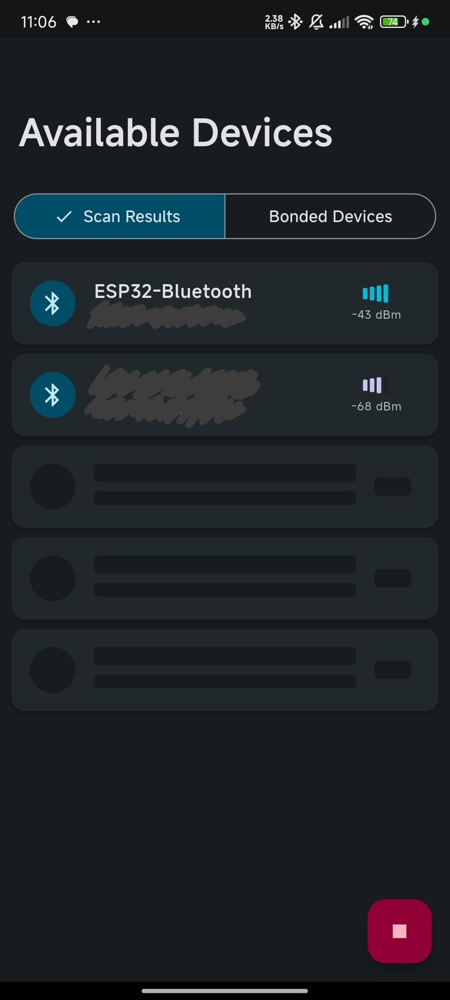
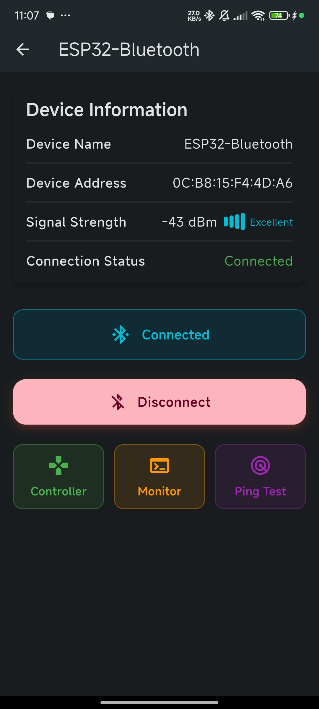
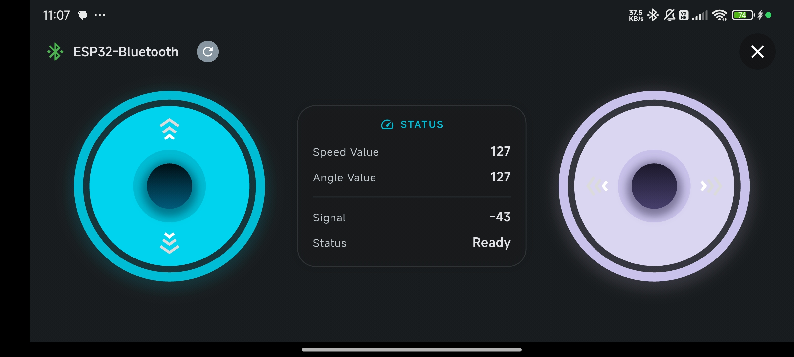
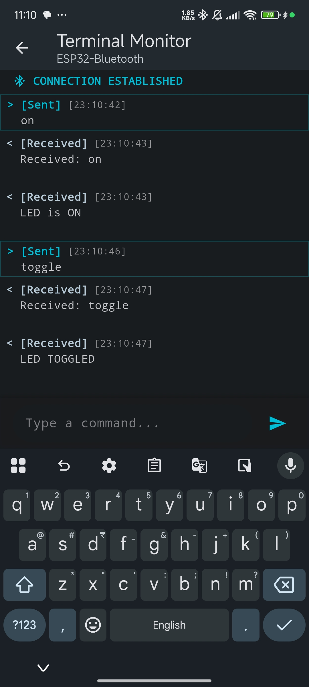

# Blue Connect

A Flutter application for Bluetooth communication with microcontrollers, designed specifically for remote control (RC) applications and Bluetooth serial communication.

## Features

- Scan and connect to Bluetooth devices
- Remote control interface with virtual joystick
- Real-time speed and angle display
- Terminal mode for direct Bluetooth serial communication
- Device connection management

## Screenshots

<div style="display: flex; flex-wrap: wrap;">
  
  
  
  
</div>

## Getting Started

### Prerequisites

- Flutter SDK
- Android Studio or VS Code with Flutter extensions
- Android or iOS device with Bluetooth capabilities

### Installation

1. Clone the repository
```
git clone https://github.com/your-username/blue_connect.git
```

2. Navigate to the project directory
```
cd blue_connect
```

3. Install dependencies
```
flutter pub get
```

4. Run the app
```
flutter run
```

## ESP32 Sample Code

For RC car control with ESP32 microcontrollers, you can use the companion ESP32 code available at:
[https://github.com/darkard2003/blueSpeedControl.git](https://github.com/darkard2003/blueSpeedControl.git)

This repository contains the necessary Arduino code for your ESP32 board to:
- Connect via Bluetooth with the Blue Connect app
- Receive control commands for RC car operation
- Control motor speed and direction based on joystick input
- Handle additional control functions

To use:
1. Clone the ESP32 repository
2. Upload the code to your ESP32 board using Arduino IDE
3. Connect to your ESP32 from the Blue Connect app
4. Use the remote control interface to drive your RC car

## RC Control Protocol

For detailed information about the RC control protocol, including packet structure, value mapping, and implementation details, see the [RC Control Protocol Documentation](docs/rc_control_protocol.md).

This documentation explains:
- How joystick values are mapped to control values
- The 2-byte packet structure used for communication
- How to implement compatible receivers on microcontrollers
- Display feedback and connection management features

## Future Goals

- Add support for custom command presets
- Implement profile management for different devices
- Add macOS and Windows support
- Improve UI/UX with additional themes

## Contributing

Contributions are welcome! Please feel free to submit a Pull Request.

## License

This project is licensed under the MIT License - see the LICENSE file for details.